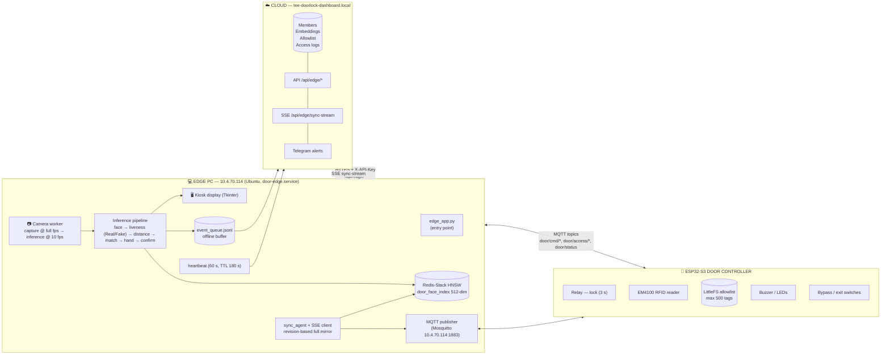
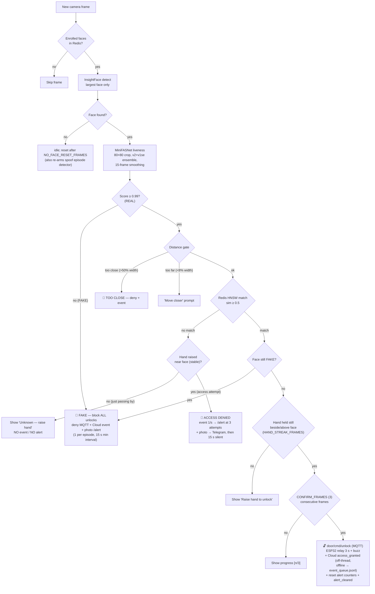
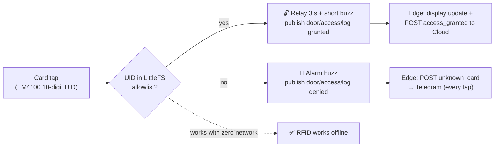
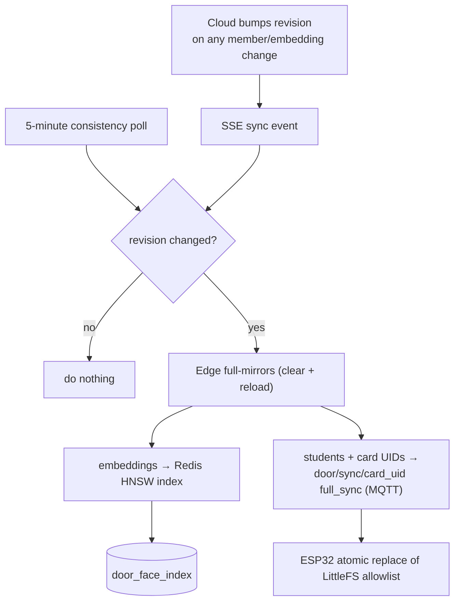
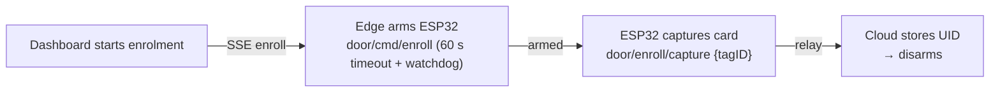
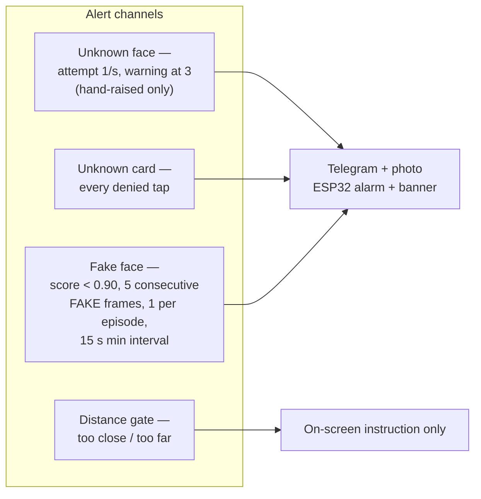

# Door-Edge V2 — System Map (Flowcharts)

Rendered with Mermaid — view in GitHub, GitLab, or VSCode (Markdown preview).

---

## 1. Architecture map (3 tiers)

---

## 2. Face unlock decision flow (per inference frame)

---

## 3. RFID unlock flow (ESP32, offline-first)

---

## 4. Sync flow (Cloud → edge → ESP32)

---

## 5. Card enrolment flow

---

## 6. Security / alert channels

